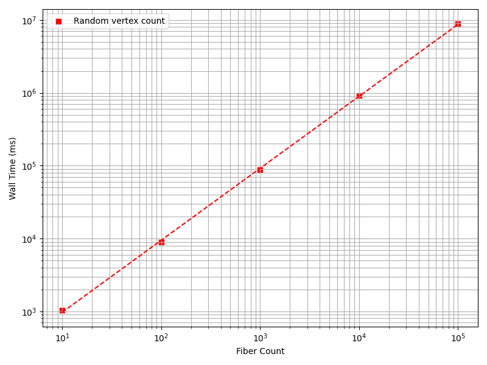
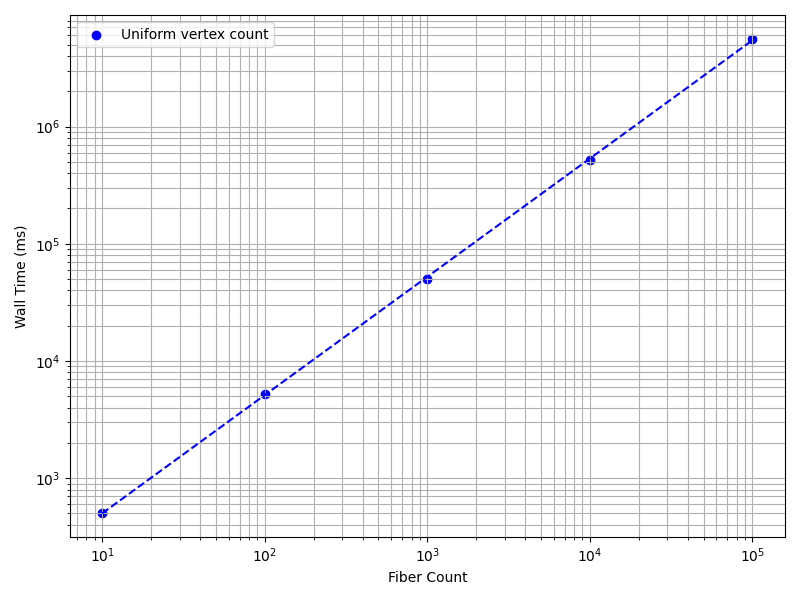
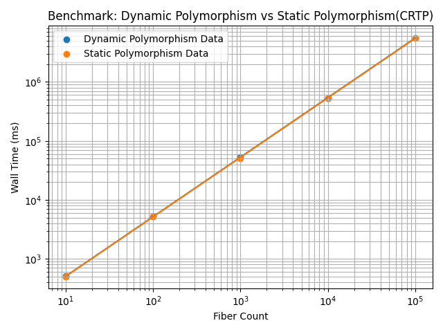

# Developer Guide

This document provides in-depth explanation of the implemented algorithms, data structures, software architecture, benchmarks etc.

## Algorithms and Data Structures
Refer to the [code](technical/biomesh_dsa.pdf) document.

## Design Patterns
- **Strategy pattern:**

This pattern was used in the ```fiber_grid``` class to apply affine transformations to the fiber vertices. In our context, it is implemented as the ```injection``` variant. This is achieved by declaring a generic interface as:
```bash
template <typename... Args>
  void transformation (
      std::function<void (std::vector<fiber> &, Args...)> transform_function,
      Args... args);
```
This serves as the common interface for the family of affine transformation algorithms.

- **Curiously Repeating Template Pattern:**

This pattern was used for the fiber heiarchy. Initially, the base class ```fiber``` declared the ```generate_fiber``` function as pure virtual. The CRTP pattern was prefered due to following reasons:
1. No requirement for runtime polymorphism. The ```fiber_grid``` object is either 2D or 3D.
2. The ```generate_fiber``` is the main kernel to generate fibers and performance is critical. 

Refer to the **Benchmarks** section for comparison between runtime with CRTP and runtime without CRTP.

## Benchmarks

### CASE 1: Random vertex count benchmark

### Overview
- This benchmark measures the runtime performance when every fiber has unequal vertex counts.
- The ```tube_fibers``` example was used for measurements.
- The benchmark was executed serially.

### Hardware
| Component        | Details                               |
|-----------------|--------------------------------------|
| CPU              | Intel(R) Core(TM) i5-8250U CPU @ 1.60GHz |
| Cores / Threads  | 8 / 16                               |
| L1 Cache         | 128 KB                           |
| L2 Cache         | 1 MB                            |
| L3 Cache         | 6 MB                                  |

### Results

| Fiber Count |  Wall time (ms)|
|------------:|----------------------------------------|
| 10          | 1032.0459                   | 
| 100         | 8881.7594                  |
| 1000        | 88206.6199                 |
| 10000       | 910531.8686                |
| 100000      | 8923717.8654               |

  
*Figure: Plot demonstrating scaling results with random vertex counts.*

### CASE 2: Equal vertex count benchmark

### Overview
- This benchmark measures the runtime performance when every fiber has equal vertex counts.
- The ```tube_fibers``` example was used for measurements.
- The benchmark was executed serially.

### Hardware
| Component        | Details                               |
|-----------------|--------------------------------------|
| CPU              | Intel(R) Core(TM) i5-8250U CPU @ 1.60GHz |
| Cores / Threads  | 8 / 16                               |
| L1 Cache         | 128 KB                           |
| L2 Cache         | 1 MB                            |
| L3 Cache         | 6 MB                                  |

### Results

| Fiber Count |  Wall time (ms)|
|------------:|----------------------------|
| 10          | 502.2362                   |
| 100         | 5272.9212                  |
| 1000        | 50020.0531                 |
| 10000       | 522941.6485                |
| 100000      | 5610230.8736               |


*Figure: Plot demonstrating scaling results with equal vertex counts.*

### CASE 3: CRTP benchmark

### Overview
- This benchmark measures the runtime performance when using static polymorphism via the CRTP pattern for the ```fiber``` class heiarchy.
- The ```cuboid_fibers``` example was used for measurements.
- The benchmark was executed serially.

### Hardware
| Component        | Details                               |
|-----------------|--------------------------------------|
| CPU              | Intel(R) Core(TM) i5-8250U CPU @ 1.60GHz |
| Cores / Threads  | 8 / 16                               |
| L1 Cache         | 128 KB                           |
| L2 Cache         | 1 MB                            |
| L3 Cache         | 6 MB                                  |

### Results

| Fiber Count |  Runtime with Dynamic Polymorphism (ms) | Runtime with CRTP (ms)   | 
|------------:|----------------------------------------:|-------------------------:|
| 10          | 505.5093                   |  502.2362        |
| 100         | 5185.8594                  | 5272.9212        |
| 1000       | 53508.6688                 | 50020.0531       |
| 10000      | 534434.1495                | 522941.6485      |
| 100000     | 5558305.7331               | 5610230.8736     |

- **Average speedup:** 1.0145
- **Runtime reduction:** 1.43%

  
*Figure: Plot comparing runtimes between Dynamic Polymorphism and Static Polymorphism(CRTP).*