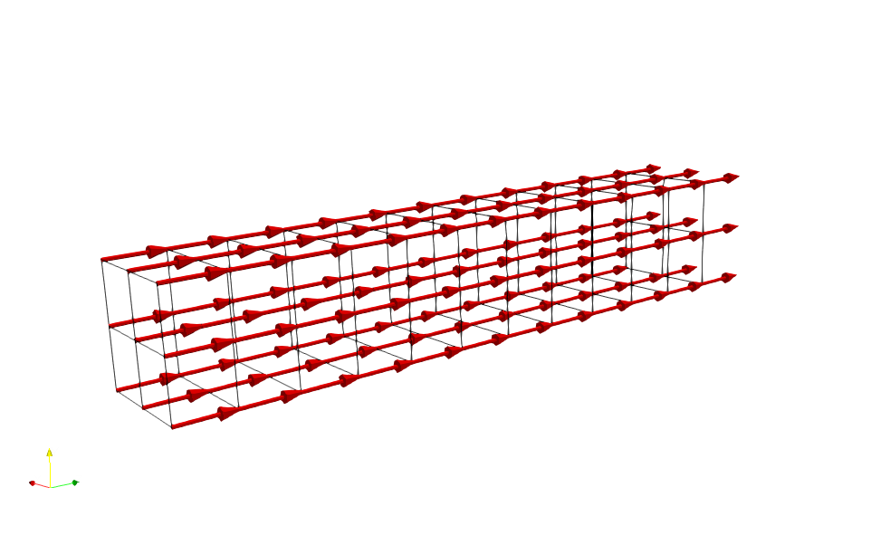
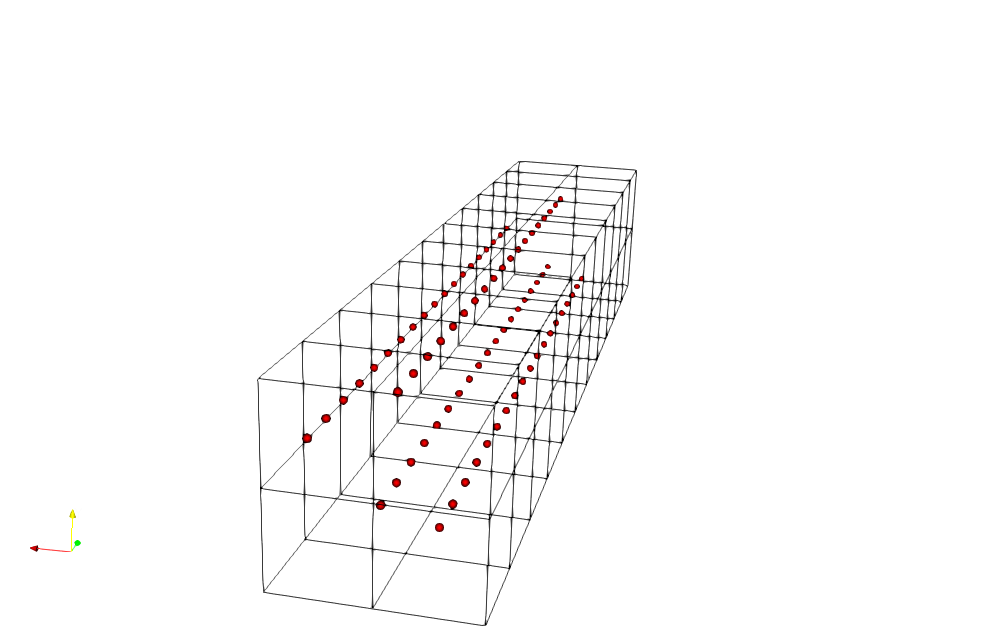

# HELLOWORLD

This document provides a minimal example to demonstrate the usage of BioMesh library.

We refer to the ```cuboid_fibers``` example located in the ```examples``` directory.

## Prerequisites

1. BioMesh is installed on your machine.

## Required input files

The input files to run the examples is located in the ```examples/cuboid_fibers``` folder in the **source directory.**
- ```cuboidal_vector_field.vtk```
Visualization in ```paraview```:


- ```fiber_config.xml```
Overview of content:
```bash
<?xml version="1.0" encoding="UTF-8"?>
<fiber_set>
    <seed_vertex_count>4</seed_vertex_count>
    <vertex_width>0.5</vertex_width>

    <integration_scheme>runge-kutta4</integration_scheme>
    <time_step_max>1600</time_step_max>
    <adaptive_steps_max>0</adaptive_steps_max>
    <strategy>static</strategy>

    <plane_point>
        <x>1.0</x>
        <y>1.0</y>
        <z>5.5</z>
    </plane_point>

    <plane_normal>
        <x>0.0</x>
        <y>0.0</y>
        <z>1.0</z>
    </plane_normal>

</fiber_set>
```

## Source file

The ```cuboid_fibers.cpp``` contains the source code to call the necessary functions.

Overview:
```bash
#include <biomesh.hpp>
#include <iostream>

using namespace biomesh;
using fiber_grid3d = fiber_grid<fiber3D, vertex3D>;

int
main (int argc, char **argv)
{
  /* Load vector field from VTK file. */
  vector_field field (argv[1], argv[2]);
  field.load_vtk_grid ();
  field.preprocess ();

  /* Generate fibers. */
  fiber_grid3d f (argv[3]);
  f.generate_fiber_grid (field);

  /* Write fibers to JSON format. */
  json_parser jp1;
  jp1.export_fiber_grid_json<fiber_grid3d> (f, "cuboid_fibers.json");

  /* Write fibers to VTK format. */
  visualization::export_fiber_grid_vtk<fiber_grid3d> (f, "cuboid_fibers");

  return EXIT_SUCCESS;
}
```
The source file can be broken down into 3 steps.

### Step 1:
Import the vector field from the VTK file. Refer to the code snip below:
```bash
vector_field field (argv[1], argv[2]);
field.load_vtk_grid ();
field.preprocess ();
```
- The ```vector_field``` object is constructed with two arguments:
   - The file path to the VTK file. In this context the file path to ```cuboidal_vector_field.vtk```
   - The name tag for the vector field in the VTK file. In this context the name tag is ```vectors```.

**NOTE:** The name tag depends on the input VTK file. The simplest way to obtain is to use ```paraview``` and use the glyph command. In the sidebar the name of the ```Orientation Array``` is the required name tag. 

### Step 2:
Generate the 1D fiber grids:
```bash
fiber_grid3d f (argv[3]);
f.generate_fiber_grid (field);
```
- The ```fiber_grid``` object is constructed with one argument:
   - The file path to configuration file. In this context the file path to ```fiber_config.xml```

### Step 3:
Write the 1D fiber grid to files. There are two possibilites:
   - **JSON:**  
```bash
json_parser jp1;
jp1.export_fiber_grid_json<fiber_grid3d> (f, "cuboid_fibers.json");
```
This step is mandatory because the **OpenDiHu** library needs this JSON file to import the fibers and run simulations.

   - **VTK:**
```bash
visualization::export_fiber_grid_vtk<fiber_grid3d> (f, "cuboid_fibers");
```
This step is optional and is only meant for visualization.

## Running the executable
The executable is by default installed in ```examples/cuboid_fibers``` folder in the **build directory**.

For this example, the command line syntax:
```
cuboid_fibers path/to/cuboidal_vector_field.vtk vectors path/to/fiber_config.xml
```

## Output
The fibers can be visualized using ```paraview```.

The red dots represent the fiber vertices.

