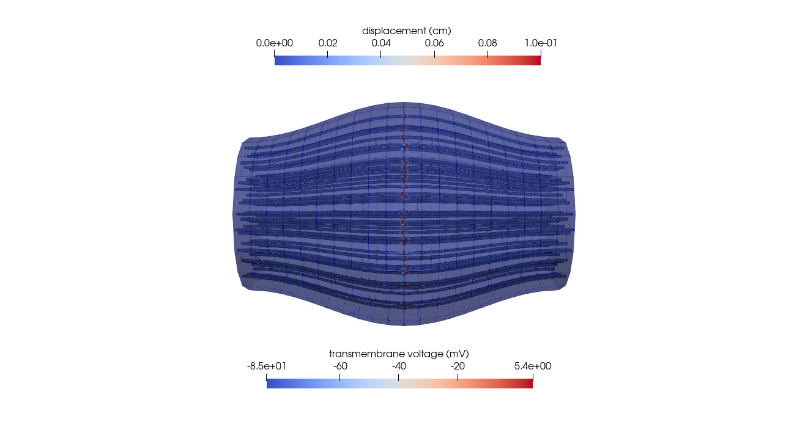
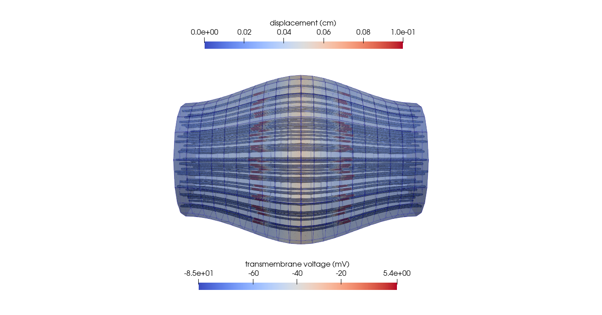
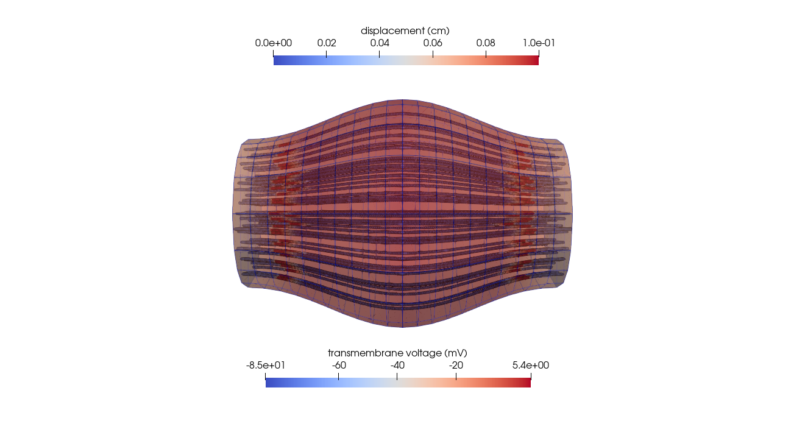
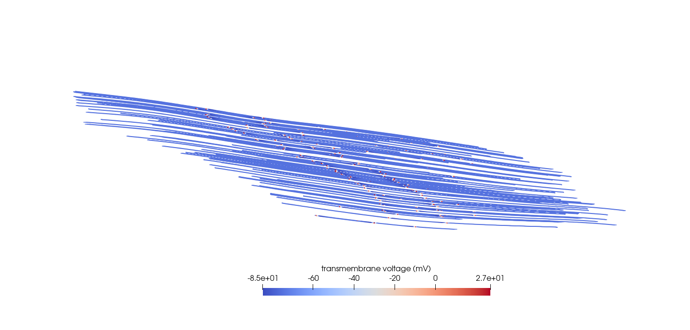

# Using BioMesh meshes to support OpenDiHu simulations

[OpenDiHu](https://github.com/opendihu/opendihu/tree/develop) is a software framework for muscle generation. It includes a solver (see [FastMonodomainSolver](https://opendihu.readthedocs.io/en/latest/settings/fast_monodomain_solver.html)) to simulation of action-potential propagation through muscle fibers, which requires fiber meshes as an input. 

### Simulating a dummy muscle

Here we show the results for an OpenDiHu chemo-electro-mechanical simulation that takes a `.json` file generated with BioMesh. The file was created by assuming a dummy geometry defined by $R_{inner}= 4.4$ *cm*, $R_{outer}= 3$ *cm* and $L= 12$ *cm*.

Time = 0 ms

Time = 10 ms

Time = 20 ms

### Simulating the Tibialis Anterior

Here we show the results for am OpenDiHu chemo-electrical simulation that also takes a `.json` file generated with BioMesh, but in this case the fibers were created using real imaging data. 

